# 🎵 BeatForge Studio - Architecture Diagrams

## How to Export These Diagrams

1. **Mermaid Live Editor**: Go to [mermaid.live](https://mermaid.live) and paste each diagram
2. **Export as PNG/SVG**: Use the export button in the live editor
3. **VS Code**: Install "Mermaid Preview" extension to view and export

---

## Diagram 1: System Architecture

---

## Diagram 2: Audio Signal Flow

```mermaid
flowchart LR
    subgraph Sources["🎵 Sound Sources"]
        OSC["Oscillators<br/>sine, square, saw, triangle"]
        NOISE["Noise Generator<br/>white, pink, brown"]
    end

    subgraph Envelope["📈 Envelope"]
        ADSR["ADSR Envelope<br/>Attack, Decay, Sustain, Release"]
    end

    subgraph Filter["🎛️ Filter"]
        BQ["Biquad Filter<br/>Lowpass, Highpass, Bandpass"]
    end

    subgraph Effects["✨ Effects"]
        REV["Convolver<br/>Reverb"]
        DEL["Delay Node<br/>Echo/Delay"]
    end

    subgraph Master["🔊 Master"]
        MG["Master Gain<br/>Volume Control"]
        ANA["Analyser<br/>Visualization"]
        DEST["Audio Destination<br/>Speakers"]
    end

    OSC --> ADSR
    NOISE --> ADSR
    ADSR --> BQ
    BQ --> REV
    BQ --> DEL
    REV --> MG
    DEL --> MG
    MG --> ANA
    ANA --> DEST
```

---

## Diagram 3: User Interaction Flow

```mermaid
flowchart TB
    START([🎵 User Opens BeatForge])
    INIT["Initialize Audio<br/>Click to start AudioContext"]
    
    subgraph Create["🎹 Create Music"]
        DRUMS["Click Grid<br/>Add Drum Beats"]
        SYNTH["Click Track Name<br/>Open Piano Roll"]
        NOTES["Draw Notes<br/>Create Melodies"]
    end

    subgraph Mix["🎚️ Mix & Adjust"]
        BPM["Set BPM<br/>40-240 range"]
        SWING["Add Swing<br/>Groove feel"]
        VOL["Adjust Volume<br/>Per track"]
        PAN["Pan L/R<br/>Stereo width"]
        FX["Add Effects<br/>Reverb & Delay"]
        MUTE["Mute/Solo<br/>Track isolation"]
    end

    subgraph Export["💾 Save & Export"]
        SAVE["Auto-Save<br/>localStorage"]
        REC["Record<br/>Capture audio"]
        WAV["Export WAV<br/>Download file"]
        JSON["Export JSON<br/>Project backup"]
    end

    subgraph Play["▶️ Playback"]
        PLAY["Play Button<br/>Start sequence"]
        STOP["Stop Button<br/>Pause playback"]
        VIS["Visualizer<br/>See waveform"]
    end

    START --> INIT
    INIT --> Create
    Create --> Mix
    Mix --> Play
    Play --> Export
    
    DRUMS --> Mix
    SYNTH --> NOTES
    NOTES --> Mix
```

---

## Diagram 4: Module Dependencies (Layered)

---

## Diagram 5: State Management Flow

---

## Diagram 6: Feature Overview (Mind Map)

---

## Diagram 7: Technology Stack

```mermaid
graph LR
    subgraph Frontend["🖥️ Frontend"]
        JS["JavaScript ES6+"]
        CSS["TailwindCSS"]
        HTML5["HTML5"]
    end

    subgraph APIs["🔌 Web APIs"]
        WA["Web Audio API"]
        LS["LocalStorage API"]
        SW["Service Worker API"]
        CA["Canvas API"]
    end

    subgraph Features["⚡ Features"]
        SEQ["16-Step Sequencer"]
        PR["Piano Roll"]
        VIS["Audio Visualizer"]
        REC["Audio Recording"]
        EXP["WAV Export"]
    end

    JS --> WA
    JS --> LS
    JS --> SW
    JS --> CA

    WA --> SEQ
    WA --> REC
    WA --> EXP
    CA --> VIS
    JS --> PR
```

---

## Quick Export Instructions

### Using Mermaid Live Editor

1. Go to **<https://mermaid.live>**
2. Copy any diagram code above (between the triple backticks)
3. Paste in the editor
4. Click **"Actions"** → **"Download PNG"** or **"Download SVG"**

### Using VS Code

1. Install extension: **"Markdown Preview Mermaid Support"**
2. Open this file and use Markdown Preview
3. Right-click diagram to save as image

### Using Figma

1. Export diagrams as SVG from Mermaid Live
2. Import SVG into Figma
3. Customize colors and styling

---

## Recommended Image Sizes for PPT

| Diagram | Recommended Size | Use For |
|---------|------------------|---------|
| System Architecture | 1920x1080 | Full slide |
| Audio Signal Flow | 1600x600 | Half slide |
| User Interaction | 1200x900 | With text |
| Module Dependencies | 1400x1000 | Technical slide |
| State Management | 1200x800 | With explanation |
| Mind Map | 1600x1200 | Overview slide |
| Tech Stack | 1200x600 | Half slide |
